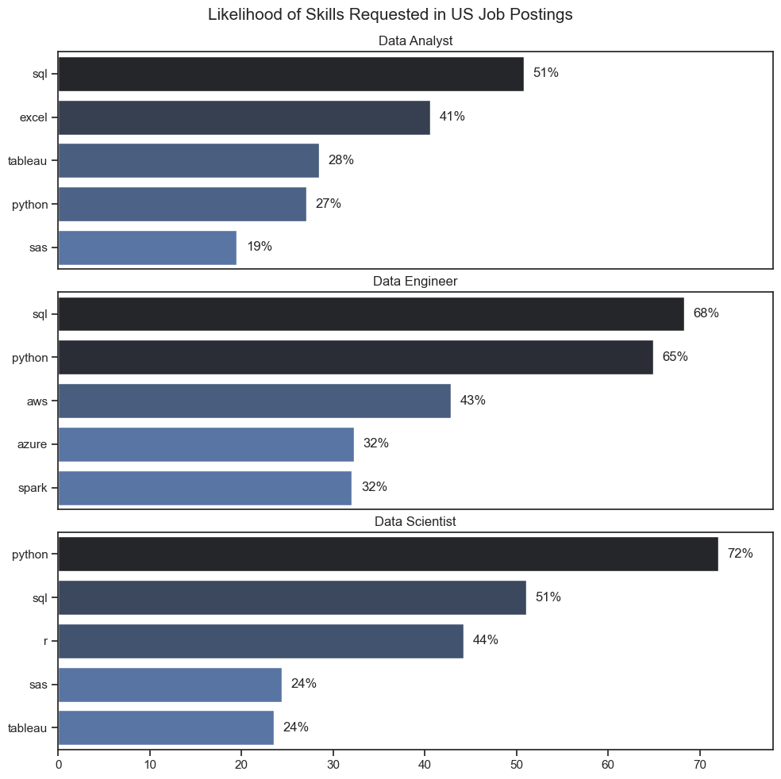
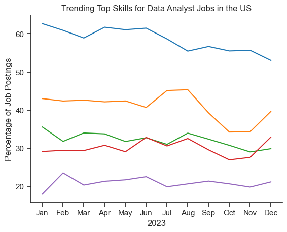
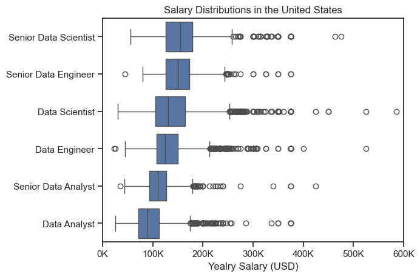

# Overview 
Welcome to my analysis of the data job market, focusing on data analysts roles. This project was created out of the desire to navigate and understand the job market more effectively. It delves into the top-paying and in-demand skills to help find optimal job opportunities for data analysts. 

The data sourced from [Luke Barousse's Python Course](https://www.youtube.com/watch?v=wUSDVGivd-8) whcih provides a foundation for my analysis, containing detailed information on job titles, salaries, locations and essential skills. Through a series of Python scripts, I explore key questions such as the most demanded skills, salary trends and the intersection of demand and salary in data analytics. 

# The Questions 
### Below are the questions I want to answer in my project: 

    1. What are the skills most in demand for the top 3 most popular data roles? 
    2. How are in-demand skills trending for Data Analytics? 
    3. How well do jobs and skills pay for Data Analysts? 

# Tools Used 

For my deep dive into the data analyst job market, I harnessed the power of several key tools: 

    . PYTHON. The backbone of my analysis, allowing me to analyse the data and find critical insights. I also used the following Python libraries:
        . Pandas Library. This was used to analyse the data. 
        . Matplotlib library. I visualised the data. 
        . Seaborn Library. Helped me create more advanced visuals. 

    . JUPYTER NOTEBBOK: The tool I used to run my Pyhton scripts which let me easilt inlclude my notes and analysis. 
    . VISUAL STUDIO CODE: My go-to for executing python scripts 
    . GIT AND GITHUB: Essential for version control and sharing my Python code and analysis, ensuring collaboration


# Data Preparation and Cleanup 
This section outlines the steps taken to prepare the data for analysis, ensuring accuracy and usability.

## Import & Clean Up Data 
I start by importing necessary libraries and loading the dataset, followed by initial data cleaning tasks to ensure data quality.

```python 
# Importing Libraries
import ast
import pandas as pd
import seaborn as sns
from datasets import load_dataset
import matplotlib.pyplot as plt  

# Loading Data
dataset = load_dataset('lukebarousse/data_jobs')
df = dataset['train'].to_pandas()

# Data Cleanup
df['job_posted_date'] = pd.to_datetime(df['job_posted_date'])
df['job_skills'] = df['job_skills'].apply(lambda x: ast.literal_eval(x) if pd.notna(x) else x)
```
## Filter US Jobs 
To focus my analysis on the U.S. job market, I apply filters to the dataset, narrowing down to roles based in the United States.
```python
 df_US = df[df['job_country'] == 'United States']

```


# The Analysis
## 1. What are the most demanded skills for the top 3 most popular data roles?


 To find the most demanded skills for the top 3 most popular data roles, I filtered out those positions by the ones that were the most popular, and got the top 5 skills for these top 3 roles. This query highligjts the most popular job titles and their top skills, showing which skills I should pay attention to depending on the role I'm targeting. 

 View my notebook with detailed steps here:  [2_Skill_Demand.ipynb](3_Project/2_Skills_Demand.ipynb)

 ### Visualise Data 

 ```python 

 fig, ax = plt.subplots(len(job_titles), 1)
sns.set_theme(style="ticks")
for i,job_title in enumerate(job_titles):
    df_plot = df_skills_perc[df_skills_perc['job_title_short'] == job_title].head(5)
    sns.barplot(data=df_plot[df_plot['job_title_short'] == job_title].head(5), x='skill_perc', y='job_skills', ax=ax[i], hue= 'skill_perc',palette='dark:b_r')
    ax[i].set_title(job_title)
    ax[i].set_xlabel('')
    ax[i].set_ylabel('')  
    ax[i].set_xlim(0,78)
    ax[i].legend().set_visible(False)  

    for n, v in enumerate(df_plot['skill_perc']):
        ax[i].text(v+1 ,n,f'{v:.0f}%', va='center', )
    if i != len(job_titles)-1: 
        ax[i].set_xticks([])
fig.set_size_inches(10, 10)
fig.suptitle('Likelihood of Skills Requested in US Job Postings', fontsize=15)
plt.tight_layout(h_pad=0.5)  
plt.show()
```

### Results 

! [Visualisation of Top Skills for Data Nerds] ()

### Insights 

- Python is a versatile skill, highly demanded across all three roles, but most prominently for Data Scientists (72%) and Data Engineers (65%). 
- SQL is the most requested skill for Data Analysts and Data Scienctists, with it in over gald the job postings for both roles. For Data Enfineers, Python is the most sought- after skill, apperaring in 68% of job postings. 
- Data Enfineers requrire more specialised technical skills (AWS, Axure,Spark) compared to Data Analysts and Data Scientists who are expected to be proficient in more general data management and analysis tools (Excel, Tableau)


## 2. How are in-demand skills trending for Data Analysts? 

### Visualise Data 

```python 
df_plot = df_DA_US_percent.iloc[:, :5]
sns.lineplot(data=df_plot, dashes=False, palette='tab10')
sns.set_theme(style='ticks')
sns.despine()

plt.title('Trending Top Skills for Data Analyst Jobs in the US')
plt.xlabel('2023')
plt.ylabel('Percentage of Job Postings')
plt.legend().remove()
plt.show()
```

### Results 

*Bar graph visulaising the trending top skills for data analysts in the US in 2023*

### Insights 
- SQL remains the most consisitently demanded skill throughout the year, although it shows a gradual decrease in demand. 
- Excel experienced a significant increase in demand starting around september, surpassing both Python and Tableau by the end of the year. 
- Both Python and Tableau show relatively stable demand throught the year with some fluctuations but remain essential skills for data analysts. Power BI, while less demanded compared to the others, shows a slight upward trend towards the year's end. 
 

 ## 3. How well do jobs and skills pay for Data 
 ### Salary Analysis for Data Nerds 
 ### Results 



### Insights 

- There is a sisgnificant distribution in salary ranges across different job titles. Senior Data Scientist postitions tend to have the highers salart potential, with up to $600k, indicating the high value placed on advanced data skills and experience in the industry. 

- Senior Data Engineer and Senior Data Scientist roles show a considerable number of outliers on the higher end of the salary spectrum, suggesting that exceptional skills or circumstances can lead to high pay roles demonstrate more consistency in salary, with fewer outliers. 

- The median salries increase with the seniority and specialisation of the roles. Senior roles not onylhave higher median salaries but also larger differences in typical salaries, refelcting greater variance in compensation as responsibilities increase. 


## The Analysis 
## 3. How well do jobs and skills pay for Data 
### Highest Paid and Most demanded skills for Data 
#### Insights: 

- The top grapgh shows specialised techinacal skills lile 'dplyr' , 'Bitbucket' and 'Gitlab' are asscociated with higher salaries. some reachin up to $200k, suggesting that advanced technical proficiency can increase earinin potential. 

- Thr bottom graph highlights the foundational skills like 'Excel', 'Power Point' and 'SQL' are the most in-demand skills, even tjough they may not offer the higer salaries. This demosntrates the importance of these core skills for employability in data analysis roles. 

- There's a clear distinction between the skills that are highest paid and those that are most in-demand. Data analysts aiming to maximise their career potential should consider developing a diverse skill set that includes both high-paying specialised skills and widely demanded foundational skills. 


# What I Learned 
Throughout this project, I deepened my understanding of the data analyst job market and enhanced my technical skills in Python, especially in data manipulation and visualization. Here are a few specific things I learned:

    .Advanced Python Usage: Utilizing libraries such as Pandas for data manipulation, Seaborn and Matplotlib for data visualization, and other libraries helped me perform complex data analysis tasks more efficiently.

    .Data Cleaning Importance: I learned that thorough data cleaning and preparation are crucial before any analysis can be conducted, ensuring the accuracy of insights derived from the data.

    .Strategic Skill Analysis: The project emphasized the importance of aligning one's skills with market demand. Understanding the relationship between skill demand, salary, and job availability allows for more strategic career planning in the tech industry.
# Insights 
This project provided several general insights into the data job market for analysts:

    . Skill Demand and Salary Correlation: There is a clear correlation between the demand for specific skills and the salaries these skills command. Advanced and specialized skills like Python and Oracle often lead to higher salaries.

    .Market Trends: There are changing trends in skill demand, highlighting the dynamic nature of the data job market. Keeping up with these trends is essential for career growth in data analytics.

    .Economic Value of Skills: Understanding which skills are both in-demand and well-compensated can guide data analysts in prioritizing learning to maximize their economic returns.
    
# Conclusion 
This exploration into the data analyst job market has been incredibly informative, highlighting the critical skills and trends that shape this evolving field. The insights I got enhance my understanding and provide actionable guidance for anyone looking to advance their career in data analytics. As the market continues to change, ongoing analysis will be essential to stay ahead in data analytics. This project is a good foundation for future explorations and underscores the importance of continuous learning and adaptation in the data field.

